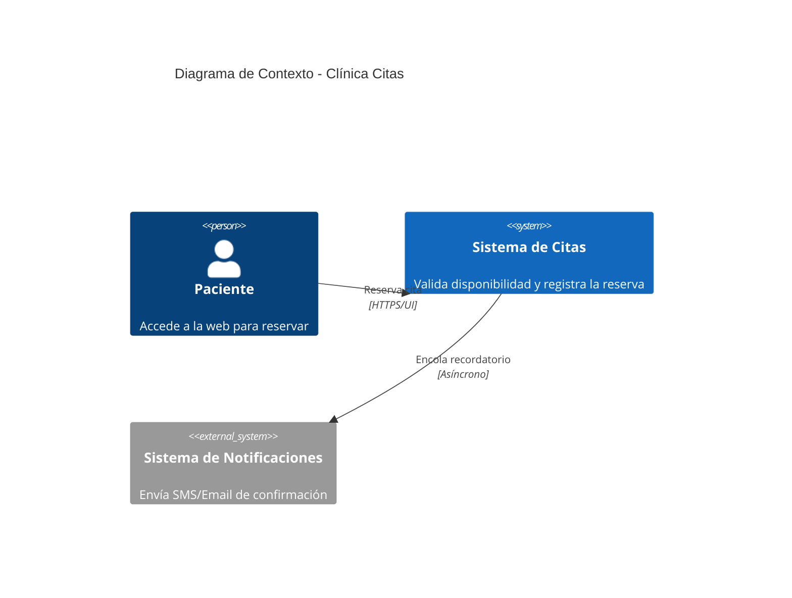
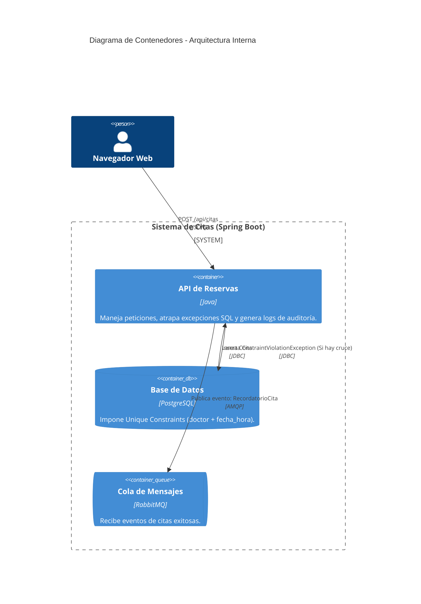

# ejercicio3-citas-medicas
# Entregable: Ejercicio 3 - Gestión de Citas Médicas y Concurrencia

## 1. Objetivo, Actores y Alcance
*   **Objetivo:** Desarrollar un sistema de agendamiento de citas médicas que garantice la integridad de los datos y prevenga el solapamiento de horarios (double-booking) mediante delegación del control de concurrencia al motor de la base de datos, asegurando además la privacidad de los datos del paciente y el registro de auditoría.
*   **Actores:**
    *   **Paciente:** Solicita la reserva de un horario con un especialista.
    *   **Sistema de Citas (Monolito):** Gestiona la lógica de reservas, atrapa errores de base de datos y encola recordatorios.
    *   **Sistema de Notificaciones:** Consumidor asíncrono que enviará los correos/SMS de recordatorio en el futuro.
*   **Alcance:** Interfaz de agendamiento, control de unicidad transaccional, simulación de encolamiento de notificaciones y persistencia exclusiva de datos mínimos (Privacy by Design).

## 2. Requisitos Funcionales y de Calidad
*   **Requisitos Funcionales:**
    *   Permitir la reserva de citas indicando paciente, doctor y fecha/hora.
    *   Bloquear de forma determinista cualquier intento de agendar dos citas a la misma hora con el mismo doctor.
    *   Guardar únicamente la información estrictamente necesaria de la cita (sin datos clínicos).
    *   Dejar un registro de auditoría (logs) de las citas creadas y los intentos bloqueados.
*   **Atributos de Calidad:**
    *   **Integridad de Datos:** Garantizada mediante restricciones estructurales (Constraints) en lugar de lógica de aplicación.
    *   **Privacidad:** Diseño basado en la minimización de datos.

## 3. Diagramas C4

### Diagrama de Contexto (Nivel 1)

### Diagrama de Contenedores (Nivel 2)

## 4. Flujo de una Operación Crítica (Prevención de Solapamiento)
1. Dos pacientes (A y B) intentan reservar a las 10:00 AM con la Dra. Gómez exactamente en el mismo milisegundo.
2. La API de Spring Boot recibe ambas peticiones en hilos separados e intenta hacer el `INSERT` en PostgreSQL simultáneamente.
3. El motor de PostgreSQL, aplicando el aislamiento de transacciones ACID, procesa una primero. La cita del Paciente A se guarda.
4. Cuando intenta procesar la del Paciente B, la base de datos detecta la violación del `UNIQUE CONSTRAINT (doctor, fecha_hora)` y lanza un error SQL (Estado 23505).
5. El backend (Java) atrapa la excepción `DataIntegrityViolationException`, evita que el servidor colapse, registra el intento fallido en el log de auditoría y responde al Paciente B con un código HTTP 400 amistoso indicando que el horario ya no está disponible.

## 5. Stack Propuesto y Justificación Arquitectónica
*   **Backend:** Spring Boot (Java 17). Facilita el manejo global de excepciones (`@ControllerAdvice`) para traducir errores crudos de la base de datos en respuestas HTTP limpias para el frontend.
*   **Base de Datos:** PostgreSQL. Fundamental para garantizar la restricción de concurrencia a nivel de esquema (Schema-level constraints).
*   **Mensajería:** RabbitMQ. Prepara el terreno para el envío de recordatorios sin retrasar la confirmación en pantalla al paciente.

## 6. Decisiones de Arquitectura y Tecnología (ADRs)

### ADR 1: Control de Concurrencia en la Base de Datos vs Capa de Aplicación
*   **Contexto:** ¿Dónde debemos validar que el horario del doctor está libre? ¿Haciendo un `SELECT` previo en Java o directamente en el `INSERT` de SQL?
*   **Decisión:** Se delega la restricción estructural a PostgreSQL utilizando `@Table(uniqueConstraints = {@UniqueConstraint(columnNames = {"doctor", "fechaHora"})})`.
*   **Justificación:** Un `SELECT` previo en Java sufre de condiciones de carrera (Race Conditions). Entre el `SELECT` que dice "está libre" y el `INSERT` final, otro hilo pudo haber ocupado el espacio. La base de datos es la única fuente de verdad capaz de aplicar bloqueos (locks) atómicos de forma eficiente y segura.

## 7. Riesgos y Plan de Mitigación
1.  **Riesgo:** Un error de base de datos no controlado (excepción no atrapada) expone la traza de la pila (Stacktrace) al usuario final, revelando información de la estructura interna.
    *   **Mitigación:** Implementación estricta de controladores de excepciones que capturan `DataIntegrityViolationException` y retornan un JSON seguro, estandarizado y sin detalles de implementación interna.

## 8. Métricas
*   **Métrica de Calidad:** *Tasa de Choque de Horarios.* Número de excepciones de llave duplicada interceptadas, lo que demuestra empíricamente cuántas citas superpuestas se previnieron de forma efectiva.